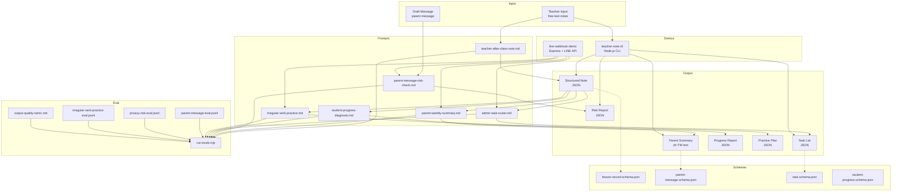
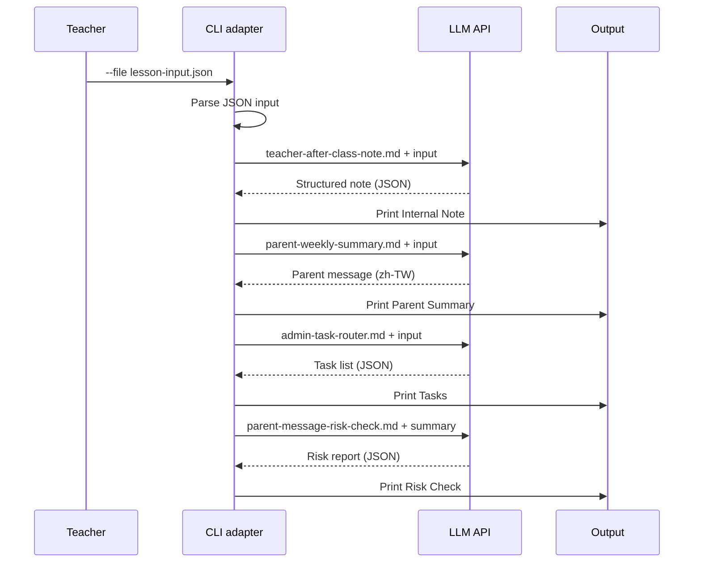
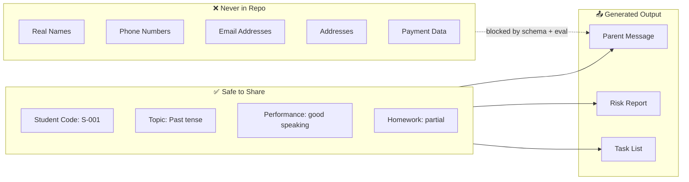

# Architecture

## System Overview



## Data Flow

### CLI Demo Flow
```
lesson-input.json
  → teacher-after-class-note.md  → structured note (JSON)
  → parent-weekly-summary.md     → parent message (zh-TW)
  → admin-task-router.md         → task list (JSON)
  → parent-message-risk-check.md → risk report (JSON)
```

Batch mode:
```
folder/*.json
  → validate each lesson record
  → run parent summary + quality gate + risk check + task extraction
  → print pass / review / fail summary table
```

### LINE Bot Flow
```
Teacher sends lesson note
  → generateLessonRecord()
  → parent-weekly-summary.md
  → quality gate + risk check
  → admin-task-router.md
  → quick reply buttons

Teacher taps "產生補強練習"
  → irregular-verb-practice.md
  → reply with focused practice plan

Teacher taps "查看黃燈學生"
  → list latest yellow / red retention signals from in-memory records
```

## Key Design Decisions

1. **JSON-driven everything.** Prompts, schemas, evals, and data are all in structured files — no hardcoded logic.
2. **Five-section prompts.** Every prompt follows Role / Task / Input / Output / Safety format for consistency and testability.
3. **Privacy by design.** Opaque student codes, no PII fields, cross-student leak detection in evals.
4. **Local-first.** Demos run locally. Only the configured LLM API is called.
5. **Eval-gated.** Changes to prompts must pass evals before merging.

## Sequence Diagrams

### CLI: Full Pipeline



### Privacy: What Data Flows Where



## File Structure

```
moosie-eduops-ai-kit/
├── prompts/                    # 6 prompt templates
│   ├── parent-weekly-summary.md
│   ├── teacher-after-class-note.md
│   ├── parent-message-risk-check.md
│   ├── admin-task-router.md
│   ├── student-progress-diagnosis.md
│   └── irregular-verb-practice.md
├── schemas/                    # 4 JSON schemas
│   ├── lesson-record.schema.json
│   ├── student-progress.schema.json
│   ├── parent-message.schema.json
│   └── task.schema.json
├── examples/
│   ├── teacher-note-cli/       # CLI demo
│   ├── line-webhook-demo/      # LINE bot demo
│   └── fake-data/              # De-identified samples
├── evals/                      # Eval sets + runner, including irregular-verb practice cases
├── scripts/                    # PII scanner + changelog generator
├── workflows/                  # Maintainer workflow docs
├── docs/                       # Extended documentation
└── .github/                    # CI, issue templates, release-notes workflow
```
